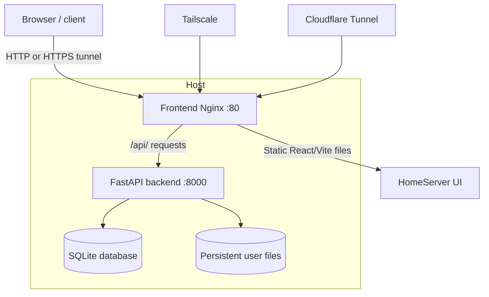
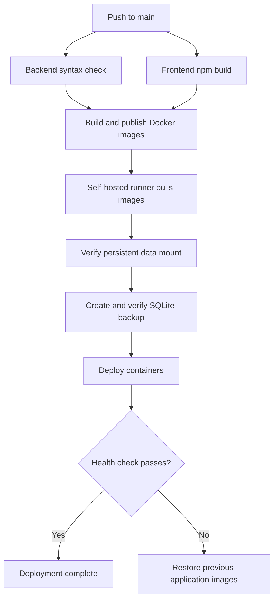
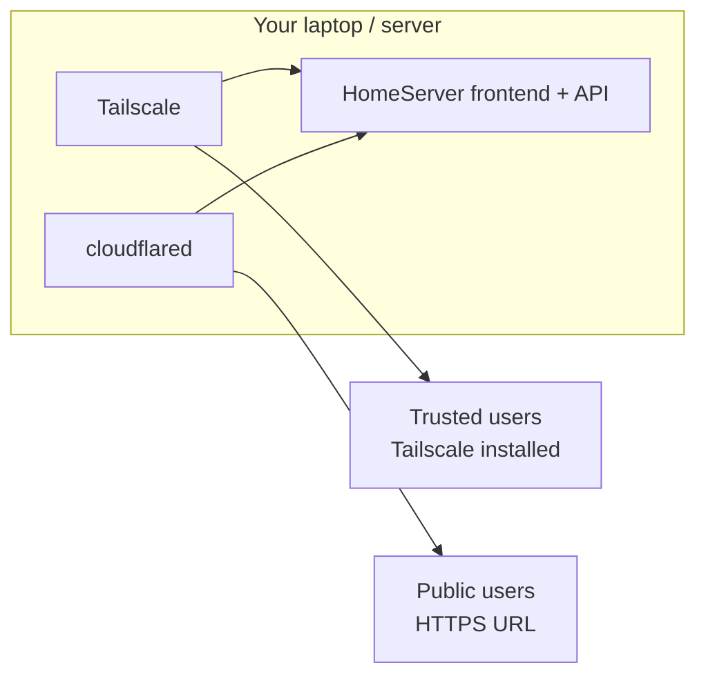

# 🏠 HomeServer — Modern, Hardened Private Cloud & Video Streaming

**HomeServer** is a private cloud storage and video-streaming application built with **FastAPI (Python)** and **React + Vite**. It lets users upload, manage, search, and stream personal files and media, with private access through **Tailscale** or optional public access through **Cloudflare Tunnel**.

This repository supports two ways to run HomeServer:

- **Local/source installation** using `install.sh` and `start.sh`.
- **Docker deployment** using Docker Compose, published container images, and the GitHub Actions CI/CD workflow.

Use the deployment method that matches your setup. The source-installation instructions below use `backend/.env`; the Docker deployment uses the environment settings passed to the backend container.

---

## ✨ Features

### 🛡️ Security Hardening

- **Mandatory `SECRET_KEY` enforcement:** the backend refuses to start if `SECRET_KEY` is missing or has a known weak/default value.
- **Configurable CORS lockdown:** strict origin checks through `ALLOWED_ORIGINS`; wildcard origins are not allowed.
- **Rate limiting:** authentication endpoints are protected with `slowapi` (`/api/auth/login`: 5 requests/minute; `/api/auth/signup`: 3 requests/minute).
- **Password complexity validation:** minimum length plus uppercase, lowercase, digit, and special-character requirements.
- **Security headers middleware:** applies Content Security Policy, `X-Frame-Options: DENY`, `X-Content-Type-Options: nosniff`, `Referrer-Policy`, `Permissions-Policy`, and `Strict-Transport-Security` when HTTPS is detected.
- **Filename and path-traversal sanitization:** protects file uploads, reads, downloads, renames, and deletions against traversal patterns such as `..`.
- **50 GB upload limit:** maximum upload size is enforced by counting streamed bytes.
- **Sanitized error handling:** client responses avoid exposing backend stack traces.

### 🎨 Modern Glassmorphic UI & Design System

- Dark theme with CSS variables, glassmorphic cards (`backdrop-filter`), gradient accents, and animated ambient orbs.
- **Interactive file dashboard:**
  - Grid and list view toggle.
  - Category filters: All Files, Videos, Music, Images, Documents, and Archives.
  - Sort by name (A–Z / Z–A), size, or date.
  - Live search and breadcrumb navigation.
  - Multi-select bulk actions, including ZIP download and deleting multiple files.
- **Upload zone:** fullscreen drag-and-drop overlay, folder-structure preservation, and individual progress bars for queued files.
- **Password-strength meter:** live requirement checks and progress indicator during registration.
- **Toast notifications:** animated success, error, warning, and information messages.
- **Connection indicator:** identifies the current access path as Private (Tailscale), Public (Cloudflare), or Local.

### 🎬 Netflix-Style Custom Video Player

- **Cinematic controls:** auto-hiding overlays after 3 seconds, a top title bar, and animated center play/pause feedback.
- **Advanced playback:**
  - Seek bar with hover-time tooltip and buffered-range indicator.
  - Playback speeds: `0.5x`, `0.75x`, `1x`, `1.25x`, `1.5x`, and `2x`.
  - Volume slider and one-click mute/unmute.
  - Fullscreen and Picture-in-Picture (PiP).
- **Zoom and pan:**
  - Smooth zoom from 1x to 4x using UI buttons or `Ctrl` + mouse scroll.
  - Click-and-drag or touch-drag panning while zoomed in.
  - Toggleable Ken Burns ambient zoom/pan effect for slideshows or background media playback.
- **Keyboard shortcuts:**

  | Shortcut | Action |
  |---|---|
  | `Space` / `K` | Play / pause |
  | `Left` / `Right` | Rewind / fast-forward 10 seconds |
  | `Up` / `Down` | Increase / decrease volume |
  | `F` | Toggle fullscreen |
  | `M` | Mute / unmute |
  | `P` | Picture-in-Picture |
  | `<` / `>` | Decrease / increase playback speed |
  | `Esc` | Exit fullscreen / close player |

### 🔐 Admin Dashboard

- User management with storage quotas, device tracking, and account controls.
- Storage-increase requests with admin approval/rejection.
- User-to-admin messaging.
- Account-deletion request management.
- Audit logs for admin actions.
- Auto-refresh with configurable intervals.

### 🔑 Password Management

- **Forgot password:** token-based reset flow; reset tokens may be printed to server logs or optionally emailed, depending on configuration.
- **Change password:** authenticated users can change their password, with session rotation.
- **Session invalidation:** existing JWT tokens are invalidated when a password is changed.

---

## 🚀 Quick Start — Source Installation

> Use this section when running the project directly from source with the setup and startup scripts.

### 1. Install

From the repository directory:

```bash
cd ~/homeserver
bash install.sh
```

The setup script is intended to:

1. Create a Python virtual environment (`env/`).
2. Install Python dependencies from `backend/requirements.txt`.
3. Generate `backend/.env` with a strong random `SECRET_KEY`.
4. Install frontend packages and compile production assets into `frontend/dist/`.

### 2. Launch HomeServer

```bash
cd ~/homeserver
./start.sh
```

The startup script may print local, LAN, and Tailscale URLs, for example:

```text
Starting HomeServer...

Server running at:
  Local:     http://localhost:8000
  Network:   http://<LAN-IP>:8000
  Tailscale: http://<TAILSCALE-IP>:8000

For public access, run cloudflared tunnel in a separate terminal.

Press Ctrl+C to stop
```

Open `http://localhost:8000` in your browser on the server. Replace the example IP placeholders with the addresses shown on your own machine.

---

## 🐳 Docker Deployment

The repository also has a Docker Compose deployment using published images from GitHub Container Registry (GHCR):

- Backend: `ghcr.io/aswina1636/home-server-backend:latest`
- Frontend: `ghcr.io/aswina1636/home-server-frontend:latest`

The current Compose configuration publishes the frontend on host port `8000`; Nginx serves the frontend and proxies `/api/` requests to the backend container. The backend is not directly published to the host.

### Architecture



### Persistent data

The production Compose configuration mounts `/data/homeserver-data` from the host into `/data` in the backend container. It configures:

- SQLite database: `/data/homeserver.db` inside the container.
- User storage directory: `/data/users` inside the container.
- Temporary files: `/tmp/homeserver` inside the container.

The host directory for the database and user files is therefore `/data/homeserver-data`. Ensure `/data` is mounted and available before deploying. **Do not delete the host data directory or its contents to troubleshoot a container.**

### Configure Docker environment variables

The backend requires a strong `SECRET_KEY`. Generate one on the server without sharing or committing the value:

```bash
python3 -c "import secrets; print(secrets.token_urlsafe(64))"
```

The Compose service must pass the secret into the backend container. A `.env` file beside `docker-compose.yml` is only used for Compose variable substitution unless the Compose service maps the variable or declares an `env_file`. For example, the backend service can use:

```yaml
services:
  backend:
    environment:
      SECRET_KEY: ${SECRET_KEY:?Set SECRET_KEY in the local .env file}
```

Then create a local `.env` beside `docker-compose.yml` (do not commit it):

```dotenv
SECRET_KEY=replace_with_your_generated_secret
```

Keep the existing Compose settings for `DATABASE_URL`, `STORAGE_PATH`, `TEMP_PATH`, and `MAX_UPLOAD_SIZE`. Do not paste your real secret into issues, chat, logs, or Git.

> **Important:** Verify that your actual `docker-compose.yml` maps `SECRET_KEY` into the backend container before deploying. The source-installation `backend/.env` file is not automatically injected into a Docker container unless Compose is configured to pass it through.

### Deploy or update containers

From the primary repository directory:

```bash
cd ~/homeserver
docker compose config -q
docker compose pull
docker compose up -d
docker compose ps
```

Check logs if a service does not start:

```bash
docker compose logs --tail=100 backend
docker compose logs --tail=100 frontend
```

Check the application endpoint:

```bash
curl -i http://localhost:8000/api/connection-info
```

### CI/CD workflow

The GitHub Actions workflow at `.github/workflows/ci-cd.yml` is configured to run on pushes to `main`. Its stages include:

1. Check out the repository and install backend dependencies, then run a Python syntax check.
2. Install frontend dependencies and build the React/Vite application.
3. Build and publish backend and frontend Docker images to GHCR, including `latest` and commit-specific tags.
4. Deploy on the configured self-hosted runner.
5. Check the running application and attempt to restore the previously running application images if deployment fails.

The deployment workflow also checks the production data mount/database, creates a timestamped SQLite backup using SQLite's backup API, checks backup integrity, and restricts backup-file permissions. Backups are written to `/data/homeserver-backups/`.

### CI/CD flow



The workflow needs a working self-hosted runner with the labels configured in the workflow, Docker access, and GitHub package permissions. Do not run destructive Docker cleanup commands against the production host unless you understand their effect on other containers and data.

### Nginx backend DNS resolution

The frontend Nginx configuration uses Docker's embedded DNS resolver (`127.0.0.11`) and a variable for the `backend:8000` upstream. This lets Nginx resolve the backend service dynamically when the backend container is replaced, rather than holding on to an old container IP.

---

## ⚙️ Configuration — Source Installation (`backend/.env`)

For the source-installation path, edit `backend/.env`:

```ini
# Mandatory high-entropy secret for JWT tokens
SECRET_KEY=replace_with_a_strong_random_secret

# Allowed browser origins, comma-separated
ALLOWED_ORIGINS=http://localhost:5173,http://localhost:8000,https://your-domain.com

# Maximum upload size in bytes (50 GiB)
MAX_UPLOAD_SIZE=53687091200

# File storage directory for the source-installation configuration
STORAGE_PATH=/data/uploads
```

Generate a suitable secret with:

```bash
python3 -c "import secrets; print(secrets.token_urlsafe(64))"
```

Include the exact origin(s) used to access the frontend in `ALLOWED_ORIGINS`. When changing environment values, restart the application. For Docker, make sure the corresponding values are explicitly passed to the container.

---

## 🌐 Hybrid Access Architecture

HomeServer can be reached through private Tailscale access and optional public Cloudflare Tunnel access, both pointing to the same application endpoint.



| Feature | Tailscale (private) | Cloudflare Tunnel (public) |
|---|---|---|
| Who can access | You and invited/trusted users | Anyone who can reach the URL, unless additional access controls are configured |
| Client setup | Tailscale app and authorized tailnet access | Browser; no Tailscale client required |
| Transport | Encrypted WireGuard tunnel | HTTPS between client and Cloudflare; tunnel to the origin |
| Example URL | `http://<TAILSCALE-IP>:8000` | `https://cloud.your-domain.com` |
| Best use | Private personal/family access | Publicly reachable access when intentionally enabled |

Actual speed and route depend on the network. Tailscale can use a direct connection or a relay depending on connectivity; do not assume every connection is direct.

---

## 📱 Private Access via Tailscale

Tailscale is the recommended option when only you and trusted users need access.

### On the server

1. Install Tailscale: <https://tailscale.com/download>.
2. Sign in and connect the server to your tailnet.
3. Find the server's Tailscale IPv4 address:

   ```bash
   tailscale ip -4
   ```

4. Ensure HomeServer is running and open:

   ```text
   http://<TAILSCALE-IP>:8000
   ```

### For trusted users

1. Install Tailscale on their device.
2. Invite them to the tailnet or share the device using the Tailscale admin console, according to your access policy.
3. Give them the server's Tailscale IP and port.
4. They open `http://<TAILSCALE-IP>:8000` while connected to Tailscale and authorized to access the server.

The example URL uses HTTP. Tailscale encrypts traffic across its network, but HTTP is not end-to-end application TLS. Use HTTPS where required by your threat model and application/browser requirements.

---

## 🌐 Public Access via Cloudflare Tunnel

Cloudflare Tunnel can expose HomeServer through an HTTPS URL without opening an inbound router port. Public access means the application is reachable by people outside your tailnet; keep authentication enabled and consider adding Cloudflare Access or other access controls if the service is not intended for everyone.

### Step 1: Install `cloudflared`

For Debian/Ubuntu:

```bash
curl -L --output cloudflared.deb \
  https://github.com/cloudflare/cloudflared/releases/latest/download/cloudflared-linux-amd64.deb
sudo dpkg -i cloudflared.deb
```

Other installation options are available for Arch Linux and macOS through their package managers.

### Step 2: Quick test with a temporary URL

With the application listening on port `8000`:

```bash
cloudflared tunnel --url http://localhost:8000
```

This creates a temporary `https://<random-name>.trycloudflare.com` URL for testing. A quick tunnel is not a stable production URL.

### Step 3: Create a named tunnel with a custom domain

#### a. Create a Cloudflare account and add your domain

1. Sign up at <https://dash.cloudflare.com>.
2. Add your domain and configure its nameservers as directed by Cloudflare.

#### b. Authenticate `cloudflared`

```bash
cloudflared tunnel login
```

Complete the browser authorization for your domain.

#### c. Create a named tunnel

```bash
cloudflared tunnel create homeserver
```

Keep the generated tunnel ID and credentials file private.

#### d. Configure DNS

```bash
cloudflared tunnel route dns homeserver cloud.your-domain.com
```

Replace `cloud.your-domain.com` with the hostname you want to use.

#### e. Create the tunnel configuration

Create `~/.cloudflared/config.yml`, replacing `<TUNNEL-ID>` and the hostname with your actual values:

```yaml
tunnel: <TUNNEL-ID>
credentials-file: /home/<YOUR-LINUX-USERNAME>/.cloudflared/<TUNNEL-ID>.json

ingress:
  - hostname: cloud.your-domain.com
    service: http://localhost:8000
  - service: http_status:404
```

Find the tunnel ID with:

```bash
cloudflared tunnel list
```

The origin service above points to the host's port `8000`, which is the published frontend/Nginx port in the Docker deployment and the application port in the source-installation example.

#### f. Run the tunnel

```bash
cloudflared tunnel run homeserver
```

#### g. Optional: run as a service

After configuring and validating the named tunnel, install and enable the service using the appropriate `cloudflared` service instructions for your installation:

```bash
sudo cloudflared service install
sudo systemctl enable cloudflared
sudo systemctl start cloudflared
```

Verify the service status with:

```bash
systemctl status cloudflared
```

When DNS and the tunnel are configured correctly, the application should be reachable at `https://cloud.your-domain.com`.

### Step 4: Update CORS

For the source-installation path, add your public hostname to `backend/.env`, for example:

```ini
ALLOWED_ORIGINS=http://localhost:5173,http://localhost:8000,https://cloud.your-domain.com
```

For Docker, pass the equivalent `ALLOWED_ORIGINS` setting into the backend container if the backend reads it from the environment. Restart or redeploy the relevant service after changing the configuration.

---

## 📂 Project Architecture

The source tree includes the following main components:

```text
homeserver/
├── backend/
│   ├── main.py             # FastAPI app entry point and route definitions
│   ├── auth.py             # JWT authentication and password validation
│   ├── files.py            # File operations, uploads, streaming, range requests
│   ├── admin.py            # Admin dashboard API routes
│   ├── middleware.py       # Security headers, CSP, HSTS, range-request middleware
│   ├── database.py         # SQLAlchemy database connection
│   ├── models.py           # Database models (User, FileRecord, Device, etc.)
│   ├── promote_admin.py    # CLI script to promote a user to admin
│   ├── requirements.txt    # Python dependencies
│   └── .env.example        # Environment variable template
├── frontend/
│   ├── src/
│   │   ├── components/     # Sidebar, FileGrid, FileList, UploadZone, VideoPlayer, Modals
│   │   ├── contexts/       # AuthContext, ToastContext
│   │   ├── hooks/          # useAutoRefresh
│   │   ├── pages/          # Login, Signup, Dashboard, ResetPassword, Admin pages
│   │   ├── utils/          # File extension, size, and icon utilities
│   │   ├── api.js          # Axios API client with dynamic base URL
│   │   ├── App.jsx         # Main application routes and layout
│   │   └── index.css       # Design system and global glassmorphic CSS
│   └── dist/               # Compiled production bundle
├── nginx/
│   └── default.conf        # Nginx frontend and API reverse-proxy configuration
├── docker-compose.yml      # Docker deployment configuration
├── Dockerfile.frontend     # Frontend container build
├── install.sh              # Source-installation script
├── start.sh                # Source startup script
├── .github/workflows/
│   └── ci-cd.yml           # CI/CD pipeline
└── README.md               # Project documentation
```

This is a representative tree of the documented files; the exact repository may contain additional files.

---

## 🔒 Security Notes

- **Do not** expose port `8000` directly to the public internet through router port forwarding.
- Use Tailscale for private access, with access limited to authorized tailnet users.
- Use Cloudflare Tunnel for public access only when you intend the service to be publicly reachable; consider Cloudflare Access for an additional identity gate.
- Keep `SECRET_KEY`, tunnel credentials, and other secrets out of Git and public logs.
- Do not commit `.env` files containing real credentials. Keep them covered by `.gitignore`.
- Restrict access to database files and backups; backups can contain users' private information.
- Cloudflare Tunnel can avoid exposing your home IP through a direct inbound connection, but it does not make an application automatically safe or private.
- Keep the host, Docker images, dependencies, and application updated.

---

## 🧰 Troubleshooting

### Backend exits with a `SECRET_KEY` error

Generate a strong key:

```bash
python3 -c "import secrets; print(secrets.token_urlsafe(64))"
```

For source installation, put it in `backend/.env`. For Docker, ensure `SECRET_KEY` is passed into the backend container through `environment` or `env_file`. A file existing on the host does not mean the container receives its contents.

### Frontend shows `502 Bad Gateway`

Check both containers and their logs:

```bash
cd ~/homeserver
docker compose ps
docker compose logs --tail=100 backend
docker compose logs --tail=100 frontend
```

Confirm the backend is running and listening on port `8000` inside the Docker network. The frontend Nginx proxy expects the Compose service name `backend` on port `8000`. The dynamic Docker DNS resolver in `nginx/default.conf` helps Nginx discover a replaced backend container.

### Uploads fail for large files

- Confirm the backend `MAX_UPLOAD_SIZE` setting is configured for the desired limit.
- Confirm the frontend Nginx `client_max_body_size` is also large enough (currently documented as `50G`).
- Check available disk space and filesystem permissions in the persistent storage directory.
- When using Cloudflare Tunnel, verify that the chosen Cloudflare service and plan support the upload size and request behavior you need.

### Database or storage is missing

For the Docker deployment, verify `/data` is mounted and that `/data/homeserver-data/homeserver.db` exists on the host before deployment. Do not delete or recreate the database to troubleshoot. Inspect mount and container status first.

### Health check fails after deployment

```bash
docker compose ps
docker compose logs --tail=150 backend
docker compose logs --tail=150 frontend
curl -i http://localhost:8000/api/connection-info
```

Review the GitHub Actions deployment log for the failing step. The workflow is designed to attempt to restore the previous application images, but image rollback does not reverse database schema or data changes.

---

## 🤝 Contributing

Issues and pull requests are welcome. When reporting a problem, include relevant sanitized logs and steps to reproduce it. **Never include passwords, JWTs, `SECRET_KEY` values, tunnel credentials, or private user files.**